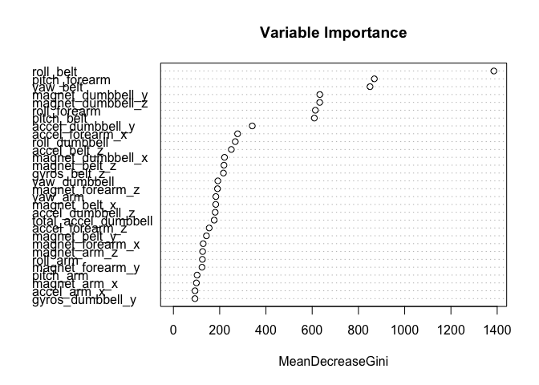

# Practical Machine Learning: Predict the manner in which they did the exercise
Kriddiphat Kongsupapsiri  
April 26, 2015  
##Synopsis
Using devices such as Jawbone Up, Nike FuelBand, and Fitbit it is now possible to collect a large amount of data about personal activity relatively inexpensively. These type of devices are part of the quantified self movement – a group of enthusiasts who take measurements about themselves regularly to improve their health, to find patterns in their behavior, or because they are tech geeks.

One thing that people regularly do is quantify how much of a particular activity they do, but they rarely quantify how well they do it. In this project, your goal will be to use data from accelerometers on the belt, forearm, arm, and dumbell of 6 participants. They were asked to perform barbell lifts correctly and incorrectly in 5 different ways.

More information is available from the website here: http://groupware.les.inf.puc-rio.br/har

##Data Processing
####1. Load required R libraries:

```r
library(caret)
library(ggplot2)
library(randomForest)
```

####2. Load Data
Download and read the data from http://groupware.les.inf.puc-rio.br/har.

```r
download.file('https://d396qusza40orc.cloudfront.net/predmachlearn/pml-training.csv'
              ,destfile='pml-training.csv',method='curl')
download.file('https://d396qusza40orc.cloudfront.net/predmachlearn/pml-testing.csv'
              ,destfile='pml-testing.csv',method='curl')
trainRaw <- read.csv('pml-training.csv', na.strings= c("NA",""))
testRaw <- read.csv('pml-testing.csv', na.strings= c("NA",""))
```

Identify number of observations and variables.

```r
dim(trainRaw)
```

```
## [1] 19622   160
```

```r
dim(testRaw)
```

```
## [1]  20 160
```

####3. Clean data
Count the number of NAs in each columns and delete Unnecessary varibles that unlikely to be related.

```r
#Remove all NA columns
colsNA <- colSums(is.na(trainRaw))==0
train <- trainRaw[, colsNA]
#Remove Unnecessary columns
removeCols <- c('X', 'user_name', 'raw_timestamp_part_1', 'raw_timestamp_part_2', 
                'cvtd_timestamp', 'new_window', 'num_window')
train <- train[, -which(names(train) %in% removeCols)]
```


```r
dim(train)
```

```
## [1] 19622    53
```

####4. Split data for Cross Validation
Create data partition in the training set to perform the cross validation.

```r
set.seed(1)
inTrain <- createDataPartition(train$classe, p=0.7, list = FALSE)
subTrain <- train[inTrain, ]
subTest <- train[-inTrain, ]
```

##Results
####1. Create the Random Forest model
Train the model using a random forest alogorithm. In this analysis, we set ntree=10 in order to reduce the time consumption in the model building process.


```r
model <- train(classe ~., data=subTrain, method="rf", ntree=10) 
model
```

```
## Random Forest 
## 
## 13737 samples
##    52 predictor
##     5 classes: 'A', 'B', 'C', 'D', 'E' 
## 
## No pre-processing
## Resampling: Bootstrapped (25 reps) 
## 
## Summary of sample sizes: 13737, 13737, 13737, 13737, 13737, 13737, ... 
## 
## Resampling results across tuning parameters:
## 
##   mtry  Accuracy   Kappa      Accuracy SD  Kappa SD   
##    2    0.9701864  0.9622653  0.003252937  0.004114234
##   27    0.9806084  0.9754589  0.002925961  0.003690282
##   52    0.9692743  0.9611166  0.005206942  0.006583609
## 
## Accuracy was used to select the optimal model using  the largest value.
## The final value used for the model was mtry = 27.
```

Calculate and plot the variable importance.

```r
varImpPlot(model$finalModel, main="Variable Importance")
```

 

####2. Cross Validation and Out of Sample Errors
Compare the predicted values from cross validation data with the observed values using Confusion Matrix.

```r
predSubTest <- predict(model, subTest)
confMatrix <- confusionMatrix(subTest$classe, predSubTest)
confMatrix
```

```
## Confusion Matrix and Statistics
## 
##           Reference
## Prediction    A    B    C    D    E
##          A 1669    2    2    1    0
##          B    6 1121    8    1    3
##          C    0   11 1009    5    1
##          D    0    0   13  948    3
##          E    1    7    2    4 1068
## 
## Overall Statistics
##                                          
##                Accuracy : 0.9881         
##                  95% CI : (0.985, 0.9907)
##     No Information Rate : 0.2848         
##     P-Value [Acc > NIR] : <2e-16         
##                                          
##                   Kappa : 0.985          
##  Mcnemar's Test P-Value : 0.2178         
## 
## Statistics by Class:
## 
##                      Class: A Class: B Class: C Class: D Class: E
## Sensitivity            0.9958   0.9825   0.9758   0.9885   0.9935
## Specificity            0.9988   0.9962   0.9965   0.9968   0.9971
## Pos Pred Value         0.9970   0.9842   0.9834   0.9834   0.9871
## Neg Pred Value         0.9983   0.9958   0.9949   0.9978   0.9985
## Prevalence             0.2848   0.1939   0.1757   0.1630   0.1827
## Detection Rate         0.2836   0.1905   0.1715   0.1611   0.1815
## Detection Prevalence   0.2845   0.1935   0.1743   0.1638   0.1839
## Balanced Accuracy      0.9973   0.9893   0.9862   0.9926   0.9953
```

Calculate accuracy:

```r
accuracy <- postResample(subTest$classe, predSubTest)[[1]]
accuracy
```

```
## [1] 0.9881054
```

Calculate out of sample error:

```r
outOfSample <- (1 - accuracy)
outOfSample
```

```
## [1] 0.01189465
```

####3. Predict testing data
Apply the original testing data and predict the results.

```r
resultTest <- predict(model, testRaw)
resultTest
```

```
##  [1] B A B A A E D B A A B C B A E E A B B B
## Levels: A B C D E
```
